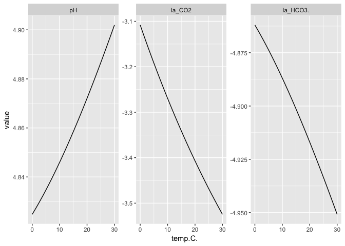

<!-- README.md is generated from README.Rmd. Please edit that file -->
``` r
library(easyphreeqc)
library(dplyr)
#> 
#> Attaching package: 'dplyr'
#> The following objects are masked from 'package:stats':
#> 
#>     filter, lag
#> The following objects are masked from 'package:base':
#> 
#>     intersect, setdiff, setequal, union
library(ggplot2)

input <- solution(pH = 6, temp = 25, units = "ppm", Ca = 100) +
  equilibrium_phases("CO2(g)" = -2) +
  reaction_temperature(low = 0, high = 30, steps = 31) +
  selected_output(activities = c("CO2", "HCO3-", "CO32-"), alkalinity = TRUE,
                  temperature = TRUE)

input %>%
  phreeqc() %>%
  filter(state == "react") %>%
  select(temp.C., pH, la_CO2, la_HCO3.) %>%
  reshape2::melt("temp.C.") %>%
  ggplot(aes(temp.C., value)) + geom_line() +
  facet_wrap(~variable, scales = "free_y")
```


